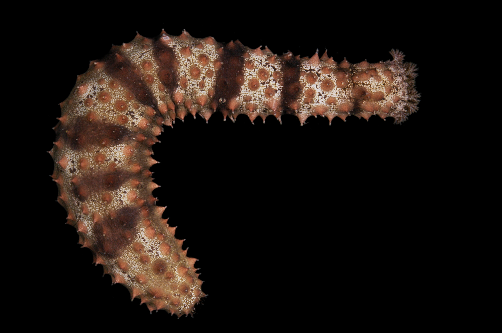
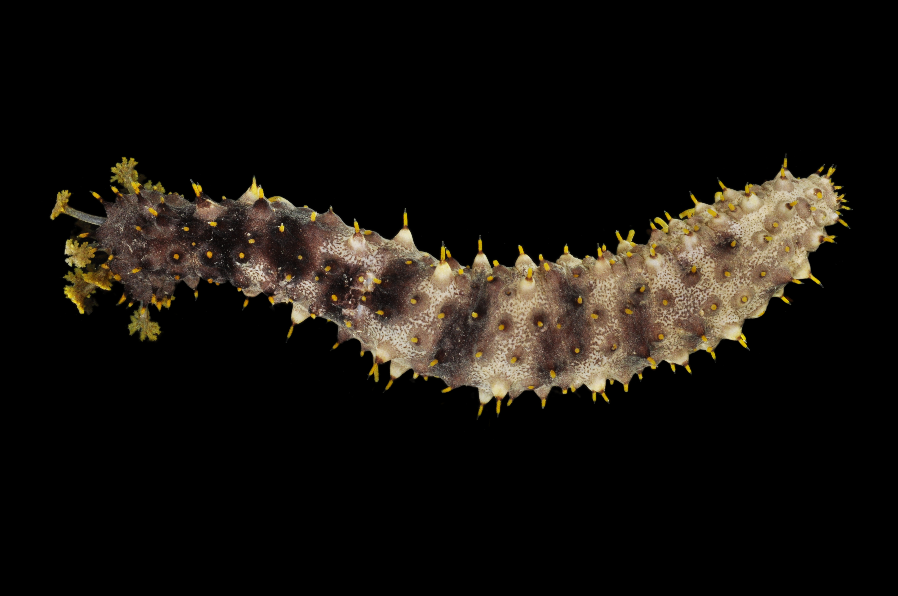

# Activity 1

Looking at the pictures below:

1. Can you guess how many species are represented?
1. Using the numbers underneath the images, group the individuals you think
   belong to the same species.

10043

11012
